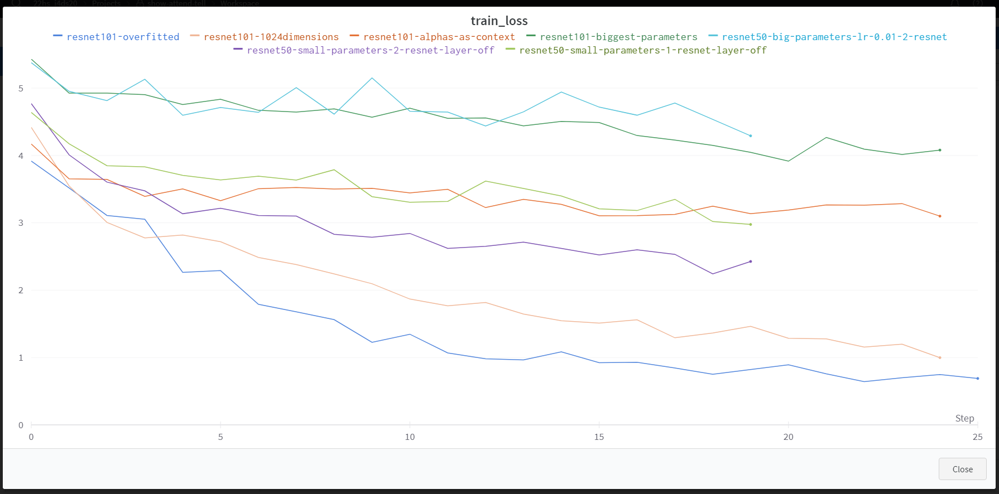
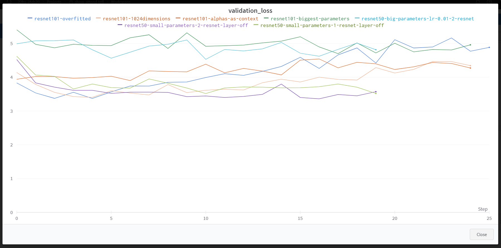

# Show, attend and tell

In the paper "Show, Attend and Tell: Neural Image Caption Generation with Visual Attention" researchers base their ideas on the notion of "paying attention" to a particular part of a given image to generate a caption for that image. This is done by recurrently adjusting attention weights that give parts of the image more attention "weight" than others. It is based on previous research that has theorized and implemented this idea: 
* [[1409.0473] Neural Machine Translation by Jointly Learning to Align and Translate (arxiv.org)](https://arxiv.org/abs/1409.0473)
* [[1412.7755] Multiple Object Recognition with Visual Attention (arxiv.org)](https://arxiv.org/abs/1412.7755)
* [Recurrent Models of Visual Attention (nips.cc)](https://papers.nips.cc/paper/2014/hash/09c6c3783b4a70054da74f2538ed47c6-Abstract.html)

In the "Show, Attend and Tell" paper, state-of-the-art performance was reached for image captioning tasks on the Flickr8k, Flickr30k, and MS COCO benchmark datasets while its predecessors focused on machine translation tasks. While in Bahdanau et al. (2015) attention is used to select relevant parts of the source sentence at each step of the translation process, "Show, Attend and Tell" uses attention to select relevant parts of the input image at each step of the captioning process.

## Model Description

The model is an encoder-decoder architecture, where an arbitrary encoder (VGGnet, Resnet) is used to generate filters for images called encoder features. In our case, the encoder takes 224x224x3 (rgb) images and outputs 2048 14x14 features. The flattened output (192x2048) is sent to the decoder. The decoder is an LSTM, which iteratively generates words based on the flattened encoder output and the attention mechanism. The encoder is frozen and won't be trained.

In the model source code the *encoder_dim* is the number of filters the encoder produces (depends on the encoder chosen) and the *decoder_dim* is the dimension that the LSTM states will be in (hidden state, cell state). The attention weights are initialized using zero vectors (batch size x maximum sequence length in batch x 192). The last dimension is equal to the flattened filter dimension (14x14). During the calculation of the attention mechanism, the attention weights (called alphas) will become weighted representations of where the filters from the encoder need to focus on.

The LSTM hidden and cell states are initialized by averaging over the filters (1x2048) and are then reduced to the LSTM dimension. Inside a loop, these states are fed into an LSTM cell together with the output of the attention part of the model to iteratively generate words for the caption. This is done until the maximum caption sentence / sequence length is reached. This means every prediction in the batch will have the same length in the end. If the model predicts a short caption, it will have padding tokens during training. There is a similar function that is used outside of training to generate captions until the *end-of-sentence* token is reached.


### Attention Mechanism

In each iteration, the attention weights are calculated using the features of the encoder and the previous hidden state of the LSTM. The features of the encoder don't change during training. What changes are the hidden state of the LSTM and the attention weights. To calculate and then use the attention weights for the LSTM cell, the encoder features and the previous hidden state of the LSTM both go through a linear layer to reduce their dimension to the attention dimension (hyperparameter). Then they can be added together using element-wise addition. The result (196 x attention dimension) is then passed through a tanh activation function and another linear layer to reduce the dimension to 1 (196 x 1) which means, that the 2048 14x14 filters / feature maps were reduced to 1 single flattened 14x14 filter / feature map where each pixel represents the significance of looking at that part of the original picture. This one filter is then softmaxed to get so-called *alphas* (in the paper they are called alphas). The alphas can be plotted onto the original image using bilinear interpolation to see where the model looks the most in the current iteration of the caption generation process. To get the final context vector (1 x 2048) that is used by the LSTM, the encoder features are multiplied with the alphas (196 x 1) and summed up along the filter dimension (1 x 2048). I didn't fully grasp why this is done. I assume that the alphas are multiplied with the encoder features to retain information about the original image instead of being passed directly into the LSTM. While testing, I tried training the model by directly passing the alphas into the LSTM and it didn't result in much different train / test loss but I also didn't test this for the overfit model, only the small model. This particular test model is stored in file resnet101-alphas.pth.

The context vector is finally concatenated with the embeddings of the previous word in the sentence. Here Teacher-Forcing is used. The predicted word doesn't matter because we force the LSTM to use the true word in the sentence for the next prediction. The word embeddings are also learned during training. Here, pre-trained embeddings could be used from a different model but wasn't tested here.

## Models

The models can be downloaded here: https://drive.google.com/drive/folders/1HnTShJgQZUCk0kpDS7GBBfMXiTSH_Q5Z?usp=sharing

* Learning-Rate = 0.001
* Batch-Size = 256
* Epochs = 25

### Small Parameters:
  * Attention Dimension = 128
  * Decoder Dimension 256

### Big Parameters:
  * Attention Dimension = 256
  * Decoder Dimension = 512

### Big Parameters:
  * Attention Dimension = 1024
  * Decoder Dimension = 1024

### Overfit Model:
  * Attention Dimension = 3000
  * Decoder Dimension = 3000

Encoder Dimension stays the same, since it's defined by Resnet.

## Results

The small model achieves the following results:
|       Dataset       |  BLEU-1  |  BLEU-2  |  BLEU-3  |  BLEU-4  |
|:-------------------:|:--------:|:--------:|:--------:|:--------:|
|     Train Data      |  0.6020  |  0.4189  |  0.2565  |  0.1334  |
|      Test Data      |  0.4465  |  0.2242  |  0.0785  |  0.0210  |
| Only Dogs Test Data |  0.5307  |  0.3220  |  0.1512  |  0.0454  |

The overfitted model achieves the following results:
|       Dataset       |  BLEU-1  |  BLEU-2  |  BLEU-3  |  BLEU-4  |
|:-------------------:|:--------:|:--------:|:--------:|:--------:|
|     Train Data      |  0.8437  |  0.7835  |  0.7440  |  0.7076  |
|      Test Data      |  0.3886  |  0.1656  |  0.0564  |  0.0130  |
| Only Dogs Test Data |  0.4702  |  0.2603  |  0.0977  |  0.0287  |

## Train and Validation Loss Plots




## Discussion

In [analysis_small_model.ipynb](./notebooks/analysis_small_model.ipynb), the small model was analyzed because it showed pretty good results that other models couldn't improve except with overfitting involved. In the plots above, the bigger models, except for the overfitting models, didn't converge soon enough and since training was taking a long time, the learning rate was adjusted which resulted in bad learning. The small model shows in its alphas that it learns basic attention in the first few steps, but this attention doesn't get updated much over the course of generating captions. Its BLEU score is pretty bad compared to the ones in the paper. The attention and decoder dimensions weren't explicitly stated in the paper, but we can assume that their model uses around 512 dimensions for both. They trained the models for a longer time and chose an adaptive learning rate algorithm (?). The BLEU score does give good results for BLEU-1 and generally the train data seems to be well fitted. In the overfit model ([analysis_overfit_model.ipynb](./notebooks/analysis_overfit_model.ipynb)) the same is true, but the difference between train and test data scores is much larger. Her we can even see, that BLEU-4 has very good scores on the training data. Surprisingly the test data scores don't suffer too much, even though the validation loss (which is equal to the test loss, since the distinction wasn't made) is high. The alphas plotted from the overfit model show weird results and the attention focuses on a big area in the first generation step. In the dog picture we can see high activation in the whole picture, except in the area that the small model looked at which is surprising. We can that the model doesn't rely solely on the attention mechanism there and it's learned parameters can predict the next word well without using attention alone or in a way that is understandable to humans when plotting back the alphas. 

The BLEU scores of dog images can also be seen in the tables above since they are overrepresented in the data. They make up over 20 percent in both train and test/validation data. Therefore the scores of dog images are better than the average. 

Spacy's textual similarity package was used to see, if the generated captions are similar to the real ones. Textual similarity is higher for training data in comparison to validation/test data but surprisingly only by a little in the small model example though much higher in the case of the overfit model.

## Installation 

Use

```
conda create --name <env-name> --file requirements.txt
conda activate <env-name>
```

to install packages.

Finally, to download the tokenizer, use

```
python -m spacy download en_core_web_sm
```
in a command line to download the english tokenizer from spacy.

To install torch use the following link to get started: https://pytorch.org/get-started/locally/

TO install cuda for GPU training: https://docs.nvidia.com/cuda/cuda-quick-start-guide/index.html

For wandb use, follow their guide on their website and use `wandb login` with your personal wandb token or exclude wandb specific lines in the train.ipynb code.

## Project Structure

```
├── all_captions                    - flickr8k captions
├── all_images                      - flickr8k images
├── models                          - contains models amd their info in csv file format using timestamps
├── notebooks                       - contains jupyter notebooks 
│   ├── train.ipynb                 - contains notebook for loading tokenizer, loading and preparing data, loading model and train loop
│   ├── analysis_small_model.ipynb  - contains notebook for analysis of small model
│   ├── analysis_overfit_model.ipynb- contains notebook for analysis of overfitting model
├── reports                         - contains figures and texts
│   └── figures
└── src                             - contains helper/utility functions
│   └── utils.py                    - contains code for encoder, decoder, attention model, dataset/dataloader, collate function, show img with caption etc...
└── README.md
└── requirements.txt

```

# Bleu score

- P = m / w (ratio of candidate words in the reference)
- Unigram precision = Clip(num word matches) / num words in generation
- unigram = 1-gram bleu
- bigram = 2-gram bleu
- trigram = 3-gram bleu and so on...
- from 0 to 1
- If a word is in the wrong place, the meaning changes, bleu doesn't capture this
- More focused on precision

# Questions

- What is the purpose of initializing the hidden state and cell state by the average value in each filter of the CNN (2048 filters) - 

"To initialize the hidden state and cell state of the LSTM cells, the authors use the average value of the CNN filters over the image as the initialization value. Specifically, they compute the average activation for each of the 2048 filters in the last convolutional layer of the CNN, and use these values to initialize the LSTM hidden state and cell state.

The purpose of this initialization strategy is to provide a reasonable starting point for the LSTM cells to generate the caption, based on the visual information in the image. By using the average filter activations as the initialization value, the LSTM cells are biased towards generating captions that are related to the visual content of the image, since the initialization values are based on the image features extracted by the CNN." - ChatGPT

# Additional Comments

* Gating scalar Beta in Chapter 4.2.1 not implemented
